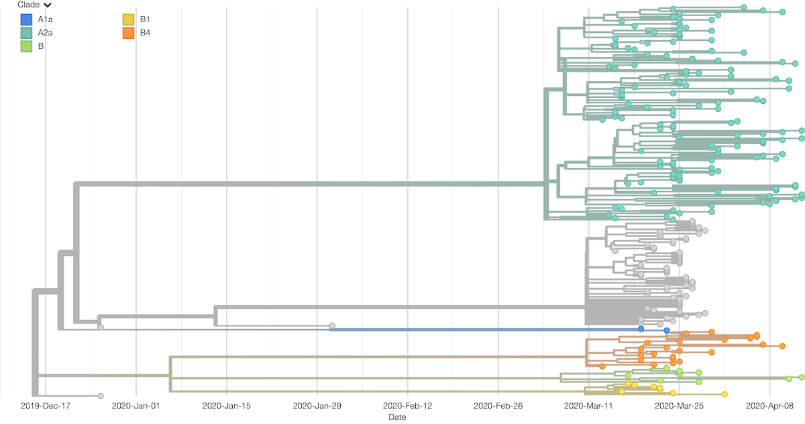
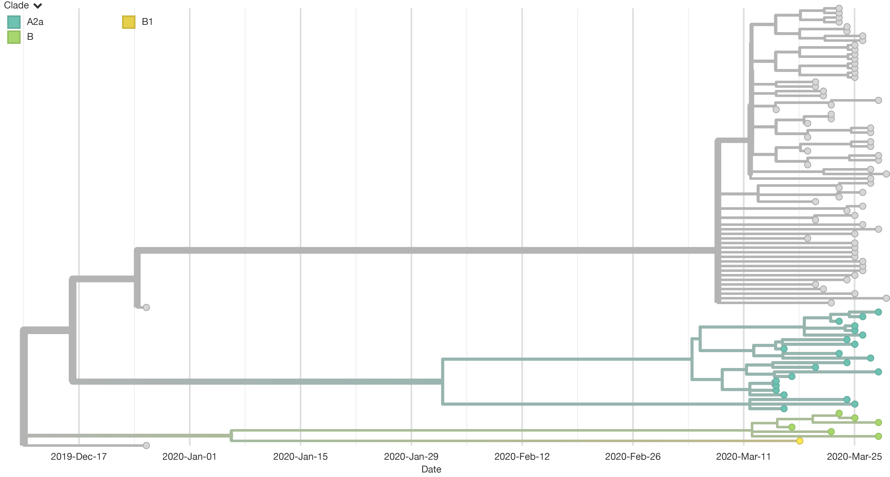
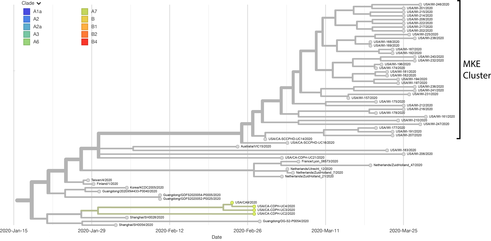
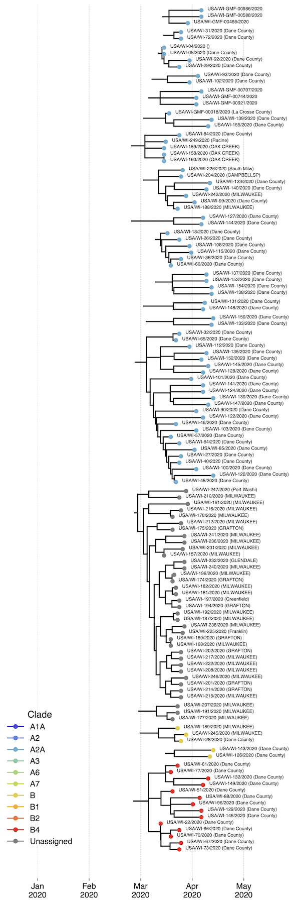

### Authors

**Gage Moreno** (graduate student in Dave O'Connor's lab) Twitter: [@GageKMoreno](https://twitter.com/GageKMoreno)

**Katarina Braun** (graduate student in Thomas Friedrich's lab)  Twitter: [@KATarinambraun](https://twitter.com/KATarinambraun) GitHub: [katarinabraun](https://github.com/katarinabraun)

**Trent Prall** (graduate student in Dave O'Connor's lab) Twitter: [@TrentPrall](https://twitter.com/TrentPrall)

---------------------
## Data availability

We have made our cleaned FASTQ* files available at the following SRA: [PRJNA614504]()

**Note these FASTQs have been depleted of host sequences and other contaminating sequences.

These analyses and scripts are additionally available on GitHub [SARS-CoV-2_sequencing](https://github.com/katarinabraun/SARS-CoV-2_sequencing)

---------------------
## Scripts used
### ONT scripts  
These data were analyzed to produce consensus sequences and to generate VCFs with consensus-level SNVs using the [ARTIC bioinformatic pipeline](https://artic.network/ncov-2019/ncov2019-bioinformatics-sop.html). 

We used a custom script to do the ARTIC bioinformatic pipeline in real time after a barcoded sample reaches 100k reads. This will allow the user to only run a flow cell for a few hours and collect consensus data in real time. This script is uploaded as `artic_rt_workflow.sh` but note that it needs to be configured to work with your desired network. Briefly, this script will watch the fastq_pass folder being made on the GridION and demultiplex each fastq file generated in real time. It will then count the number of barcodes found. Once a barcode reaches 100k reads, it will trigger the rest of the ARTIC bioinformatics workflow which will map to the severe acute respiratory syndrome coronavirus isolation from Wuhan, China (Genbank: MN908947.3) using `mimimap2`. This alignment will then be used to generate consensus sequences and variant calls.
- Note: Configure the bash script at lines 28 and 42. 

Samples were visualized using [RAMPART](https://artic-network.github.io/rampart/)

---------------------
## Introduction 
SARS-CoV-2 genome sequencing allows us to infer patterns of viral transmission through space and time and to estimate epidemiological parameters, such as number of infections, for communities independent of direct clinical testing. Milwaukee, WI has been disproportionately affected by the SARS-CoV-2 pandemic: 2,673/4,620 (58%) of the documented SARS-CoV-2 cases in Wisconsin are in the greater Milwaukee area (Milwaukee, Ozaukee, Waukesha, and Washington Counties) as of 21 April 2020. Until 20 April, no viruses from Greater Milwaukee had been sequenced. We partnered with the Milwaukee Public Health Department to sequence viruses from ~100 confirmed positive nasopharyngeal swabs. We aim to uncover the geographic origin of the viruses infecting Milwaukee residents as well as to begin to document the scope and characteristics of ongoing community spread. 

## Methods
We sequenced 100 positive samples from various areas in Milwaukee, WI. Samples arrived in the form of viral RNA (nucleic acids had already been extracted). We used 11µl of this vRNA and made the vRNA compatible for ONT sequencing using the ARTIC protocol.

We sequenced on a Oxford Nanopore Technologies (ONT) GridION using the 1D ligation sequencing kit (SQK-LSK109) with its native barcodes and sequenced on an R9.4 flow cell. 

All reads were processed using the artic_rt_workflow.sh script - a modified version of the ARTIC bioinformatics protocol. Briefly, this script triggers pipeline analysis once the number of output reads reaches 100,000. Reads were mapped to the SARS-CoV-2 isolate from Wuhan, China (Genbank: MN908947.3) using `mimimap2`. This alignment was then used to generate consensus sequences and to make variant calls. 

All consensus fasta files were then used to generate custom Nextstrain builds for (1) all Wisconsin sequences (n=249) available and (2) Milwaukee sequences only (n=94). 

## Results
### Wisconsin-only trees 
The first figure below is a phylogenetic tree with all Wisconsin viruses sequenced to date, including the Milwaukee samples. In each tree, virus sequences determined by us or others are shown as branch tips. Branches represent deduced relationships between sequences, and nodes—branch points—represent deduced common ancestors of the sequence tips they connect. In these time-resolved trees, the x-axis shows the time at which directly sequenced samples were taken, and at which deduced common ancestors most likely existed. 

The majority of Milwaukee viruses associate in one large “unassigned” clade (gray), as opposed to being intermingled with other WI (primarily Dane County) sequences. This suggests that the epidemic in Greater Milwaukee is largely driven by sustained community spread from a small number of introductions. We do not find Dane County viruses in this “unassigned” clade, suggesting that there is little mixing of viruses between Greater Milwaukee and Dane County. Some Milwaukee viruses belong to the A2a clade (turquoise), to which the majority of Dane County viruses also belong; the global tree shows that these viruses were likely introduced to Wisconsin from Europe. 

### MKE-only tree
Below is a phylogenetic tree of viruses from Milwaukee only (n=94). This tree highlights that the vast majority (n=65) of Milwaukee viruses belong to the “unassigned” (gray) clade. This is in stark contrast to Dane County, where the majority of viruses belong to the A2a clade. This tree has three main branches with common ancestors predicted to have occurred near the beginning of the pandemic. Each branch has many recent, closely-related tips – this is consistent with a few introductions into Milwaukee followed by sustained community spread. 

### Global tree
These viruses have been plotted on the global SARS-CoV-2 tree on Nextstrain, and we were able to visualize where these sequences cluster on a global scale. The “unassigned” clade, representing the largest transmission chain in Milwaukee, pictured below, is closely related to a virus detected in California and others from Asia -- China, Taiwan, and Korea. Notably, the tree shows that the last time the Milwaukee viruses collectively shared a common ancestor with sequences from anywhere else was in late February. This all suggests that there was an initial introduction, deriving perhaps from California or Asia, that took root in Milwaukee and has led to the community transmission that we are now seeing. However, since the predicted common ancestor is much farther back in time than the average serial interval, it is likely that the virus(es) that led to this local transmission cluster have not been directly sampled.

### Monophyletic Wisconsin Clusters
On the following page we have analyzed the phylogenetic tree to identify likely cases of transmission within Wisconsin. To do this, we identify Wisconsin viruses that share common ancestors with each other before they share ancestors with non-Wisconsin viruses. Node color corresponds to clade and each tip is labeled with the virus as well as the Wisconsin location. There are many fewer Milwaukee County clusters than Dane County clusters. This is again consistent with relatively few introductions of SARS-CoV-2 into Greater Milwaukee followed by sustained community spread.

* Note: Sequences labeled with Dane county were received by UW Health and Clinics, and could contain samples from the catchment area
* Note: We have filtered to only show transmission clusters ≥2 terminal nodes

## Conclusions 
The Milwaukee tree topology is consistent with a small number of SARS-CoV-2 introductions that have gone on to cause widespread community transmission in Greater Milwaukee. Viruses we have sampled from Milwaukee belong to three main genetic groups, each of which is likely undergoing simultaneous local transmission. Notably, the majority of viruses we have sequenced from Milwaukee belong to a single cluster, which is related to viruses detected in California and Asia and has likely been established in Milwaukee for some time. These patterns are in contrast to the outbreak occurring in Dane County, where there is evidence for multiple unique introductions, mostly from Europe, many of which have not undergone sustained community spread. Thus the Dane County epidemic can be seen as a large collection of small clusters, many of which have entered the county relatively recently, while in Milwaukee the epidemic is largely driven by established chains of local transmission. Evidence of ongoing community transmission in Milwaukee emphasizes the importance of continued physical distancing. Importantly, the accuracy of these inferences depends on the degree to which sampled viruses are representative of viruses circulating in Greater Milwaukee. Further sequencing of Milwaukee viruses will allow us to get a better understanding of the outbreak dynamics occurring in the Greater Milwaukee area and how they compare to the situation elsewhere in the state.