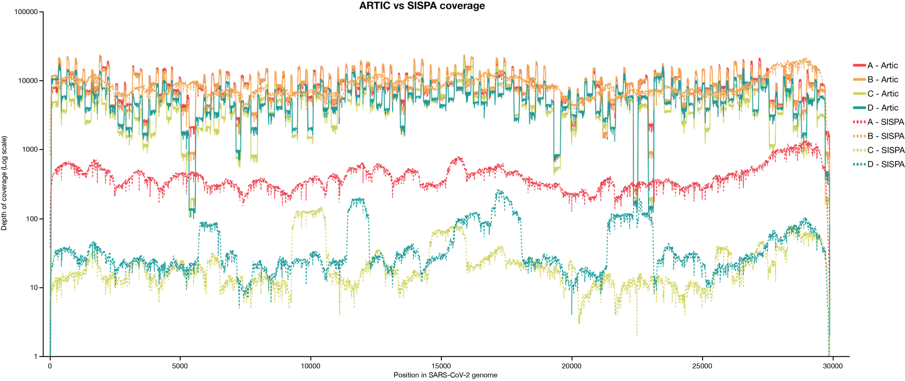
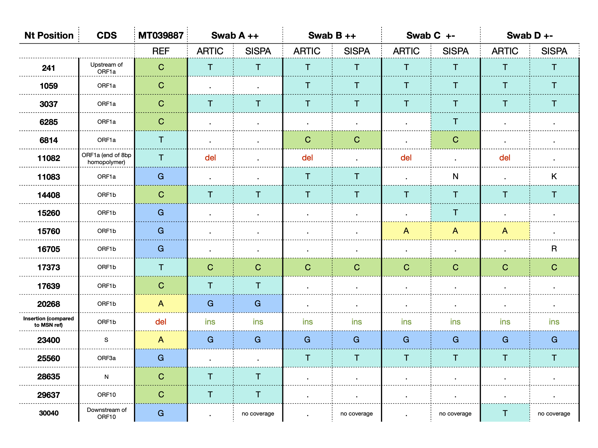
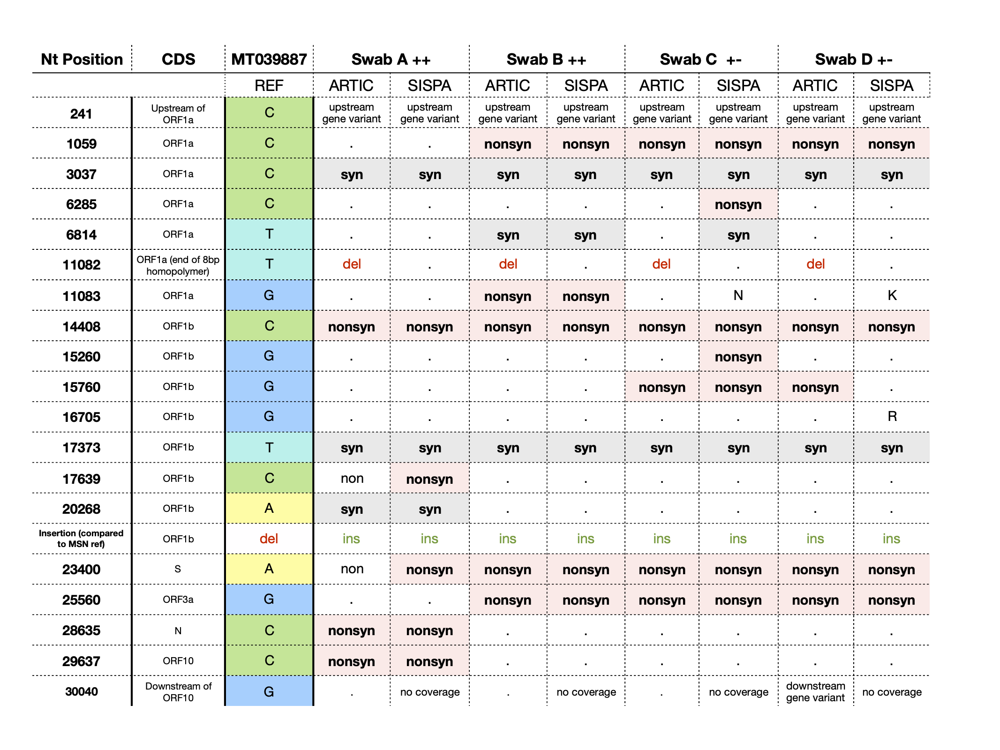
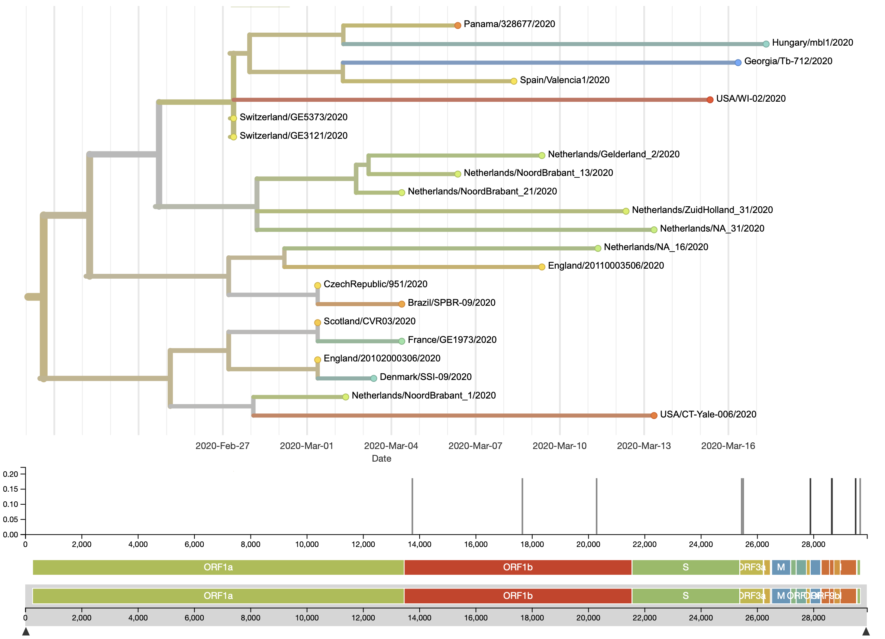
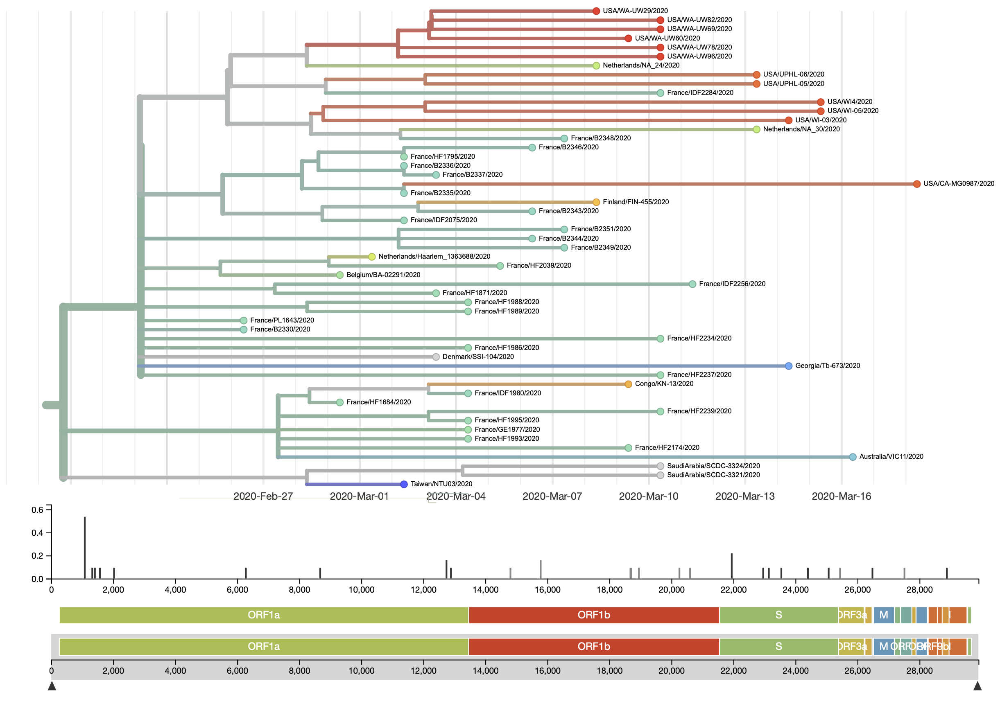

### Authors

**Katarina Braun** (graduate student in Thomas Friedrich's lab)  Twitter: [@KATarinambraun](https://twitter.com/KATarinambraun) GitHub: [katarinabraun](https://github.com/katarinabraun)

**Gage Moreno** (graduate student in Dave O'Connor's lab) Twitter: [@GageKMoreno](https://twitter.com/GageKMoreno)

---------------------
## Data availability

We have made our cleaned FASTQ* files available at the following SRA: [PRJNA614504](https://www.ncbi.nlm.nih.gov/bioproject/PRJNA614504)
To explore our data on nextstrain further - go to [Nextstrain](https://nextstrain.org/ncov?s=USA/WI-02/2020)

**Note these FASTQs have been depleted of host sequences and other contaminating sequences.

These analyses and scripts are additionally available on GitHub [SARS-CoV-2_sequencing](https://github.com/katarinabraun/SARS-CoV-2_sequencing)

---------------------
## Scripts used
### ONT scripts
The entire [ONT workflow](https://openresearch.labkey.com/wiki/ZEST/Ncov/download.view?entityId=4eb3b231-36df-1038-8f6c-473ee5860183&name=ONT_Workflow.zip) is uploaded as a series of snakemake and bash scripts that can be run one by one or can by run sequentially using the `workflow.sh` script as a driver script.
A brief description of the ONT workflow contents:
- `01.partition.sh` - will combine all ONT fastq_pass files into one merged folder and then will partition it out into 36 sub-folders to demultiplex simultaneously.
- `02.demultiplex.snakefile` - Runs `qcat` on the 36 sub-folders. Discards reads <300bp in length. Trims out ONT adaptors and barcodes.
- `03.merge-demultiplex.sh` - Merges the demultiplexed reads into a single fastq.gz for each barcode using `pigz`.
- `04.subsample_QC.snakefile` - Discards reads ≤Q7 and trims out SISPA primer sequence using `reformat.sh`.
- `05.remove-host-reagent.snakefile` - Uses `minimap` to bioinformatically deplete of host and reagent contaminants.
- `06.map-reference-genome.snakefile` - Maps cleaned reads to a reference file using `minimap` and will call variants ≥10% frequency using `callvariants.sh`.
- `06.bam_to_fastq.snakefile` - Converts the mapped bam file to fastq using `reformat.sh`.
- `07.map-by-gene.snakefile` - Maps cleaned reads to a reference file composed of only the coded gene regions using `minimap`.
- `08.call-variants-by-gene.snakefile`- Call variants in the coded gene regions using `callvariants.sh`.
- `09.minhash.dataset.snakefile` - Performs `sendsketch.sh` on the entire dataset - outputs the top 1000 hits in your sample.
- `09.minhash.sequences.snakefile` - Performs `sendsketch.sh` and classifies reads on a per sequence basis

## Methods
We sequenced four positive samples from Madison, WI.  
We isolated viral RNA using the Maxwell 48. Complete protocol can be found [here](https://openresearch.labkey.com/wiki/ZEST/Ncov/download.view?entityId=b803632d-48fb-1038-80cc-8e513fde0084&name=Maxwell%20RSC%20Viral%20Total%20Nucleic%20Acid%20Purification%20Kit%20TM420.pdf)

We prepared each sample for ONT sequencing using two different sequencing protocols: 
1. SISPA [complete protocol](https://www.protocols.io/view/sequence-independent-single-primer-amplification-o-bckxiuxn).  
2. ARTIC [complete protocol](https://www.protocols.io/view/ncov-2019-sequencing-protocol-bbmuik6w).

We then prepared libraries for Oxford Nanopore Sequencing on a GridION using the 1D ligation sequencing kit (SQK-LSK109) with its native barcodes and sequenced on an R9.4 flow cell. 

Millions of ONT reads were available within 14 hours of initiating sequencing. SISPA prepped reads were demultiplexed using `qcat` and bioinformatically depleted of host and reagent contaminants. ARTIC reads were also demultiplexed using `qcat` but were not depleted of host and reagent contaminants. All reads <300bps in length were discarded as well as reads with a quality score ≤Q7. Cleaned viral reads were then mapped to the severe acute respiratory syndrome coronavirus 2 isolate 2019-nCoV/USA-WI1/2020 reference using `mimimap2` (Genbank: MT039887.1, originally sequenced by the CDC).  The resulting mapped reads were then imported to Geneious Prime 2020 to visualize the reads and generate consensus sequences.

## Results
---------------------
### Coverage across SARS-CoV-2 genome
Here we show the results for each sequencing approach. The ARTIC protocol generated consistent coverage based on positivity – which is determined by the number of replicates turning up positive. SISPA generated a comparable overall number of reads to the ARTIC protocol (except for sample A), but many fewer of these reads mapped to reference than in the ARTIC dataset. For this reason - we are likely to continue with ARTIC sequencing and will use SISPA when a SARS-CoV-2 diagnosis has not been confirmed. 

| Sample  | Total artic reads | Mapping artic reads | Total SISPA reads | Mapping SISPA reads |
|---------|-------------------|---------------------|-------------------|---------------------|
| Swab A |734,474           | 743,002             | 241,941           | 20,713              |
| Swab B | 742,693           | 742,142             | 768,410           | 329,414             |
| Swab C | 409,747           | 408,420             | 518,336           | 1,082               |
| Swab D | 478,058           | 475,250             | 648,403           | 1,909               |

---------------------
### Consensus level differences between swabs and comparing ARTIC to SISPA

We mapped all swabs against the first Madison reference sequence (MT039887.1) and identified consensus-level differences from the Madison reference sequence and the four swabs we sequenced here. We also looked at the consensus-level differences in library preparations methods -- ARTIC and SISPA -- for each swab. 

Swab A differed from the Madison reference sequence at 8 positions (6 within open reading frames). Additionally, swab A does not contain the defining 3bp in-frame deletion in ORF1b that the Madison reference contains. Swab A consensus contains one deletion at nucleotide position 11,082 (ORF1a), but this is at the end of an 8bp homopolymer region, so is likely an ONT sequencing artifact. Apart from this deletion at 11,082, the ARTIC consensus sequences are identical to the SISPA sequence. 

Swab B differed from the Madison reference sequence at 9 positions (8 within open reading frames). Swab B, like swab A, does not contain the defining 3bp in-frame deletion in ORF1b that the Madison reference contains. Swab B consensus contains the likely-artifact at nucleotide 11,082 (ORF1a). Like swab A, swab B consensus sequences for ARTIC and SISPA are identical apart from this deletion at 11,082. 

Swab C differed from the Madison reference sequence at 8 positions (7 within open reading frames) in the ARTIC consensus sequence and at 11 positions (10 within open-reading frame) in the SISPA consensus sequence. Swab C does not contain the defining 3bp in-frame deletion in ORF1b that the Madison reference contains and does contain the likely-artifact deletion at 11,082 (ORF1a).  Swab B consensus contains the likely-artifact at 11,082 (ORF1a). The ARTIC and SISPA consensus sequences differ by nucleotide positions 6285, 6814, and 15,260 which are areas of relatively low-coverage in the SISPA sample. 

Swab D differed from the Madison reference sequence at 9 positions (8 within open reading frames). Swab D also does not contain the defining 3bp in-frame deletion in ORF1b that the Madison reference contains. Swab D consensus contains the likely-artifact at deletion at 11,082 (ORF1a). Swab D SISPA and ARTIC consensus sequences differ at nucleotide position 15,760. Swabs C and D are nearly identical at the consensus level so are like part of the same transmission chain within Madison, WI. 

Here’s a table outlining consensus-level SNV differences among swabs as well as ARTIC vs SISPA library preparation methods.

We also took a quick look at the impact of each of these SNVs and have included these annotations in this table.

*Syn*: synonymous variant, silent mutation
*Nonsyn*: nonsynonymous variant, amino-acid changing mutation 

Swab A contains 3 synonymous variants and 3-5 nonsynonymous variants.  
Swab B contains 3 synonymous variants and 5 nonsynonymous variants. 
Swab C contains 2-3 synonymous variants and 5-7 nonsynonymous variants. 
Swab D contains 2 synonymous variants and 4-5 nonsynonymous variants. 

There are too few consensus-level SNVs to make confident inferences regarding population selective pressures. We have not called minor variants at this time, but hope to do this soon. 

Overall, SISPA and ARTIC consensus sequences are closely aligned, however there are a few consensus differences noted. Given the dramatically-higher coverage obtained using the ARTIC protocol (approximately 30x fold coverage compared to SISPA), we have decided to proceed with the ARTIC protocol in favor of SISPA. Additionally, we have uploaded the ARTIC consensus sequences to GISAID and these are the sequences that were fed into Nextstrain as well. 

---------------------
### Nextstrain phylogenies 
Consensus sequences were uploaded to GISAID and subsequently added to Nextstrain for phylogenetic analyses. Sample naming scheme is in the table below. 

| Sample  | GISAID EPI ISL | Nextstrain Name |
|---------|----------------|-----------------|
| Swab A | 416489         | [USA/WI-02/2020](https://nextstrain.org/ncov?s=USA/WI-02/2020)  |
| Swab B | 416523         | [USA/WI-03/2020](https://nextstrain.org/ncov?s=USA/WI-03/2020)   |
| Swab C | 416491         | [USA/WI4/2020](https://nextstrain.org/ncov?s=USA/WI4/2020)     |
| Swab D | 416492         | [USA/WI-05/2020](https://nextstrain.org/ncov?s=USA/WI-05/2020)   |

Based on Nextstrain phylogenetic analysis, it looks like there have been at least three separate introductions of SARS-CoV-2 into Wisconsin. The first of which - USA/WI-02/2020 - clusters with other European sequences and is distinct from USA/WI-01/2020 that originated in China. 
 

The other three samples (USA/WI-03 through WI-06/2020) all cluster together also originating from European sequences. This suggests that a local transmission cycle originated from USA/WI-03/2020 SARS-CoV-2 virus. Future sequencing efforts will need to determine if there is sustained transmission of these viruses within Madison, WI.  

---------------------
