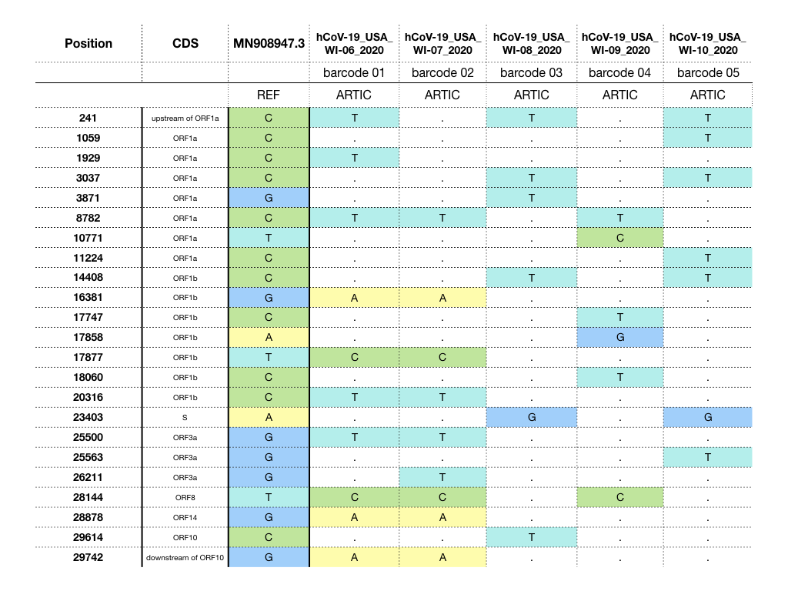
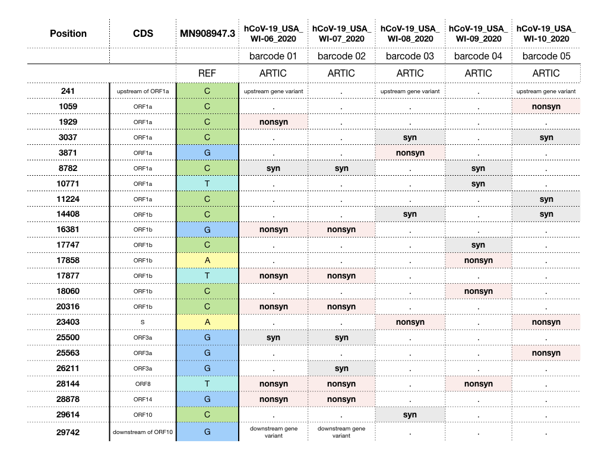
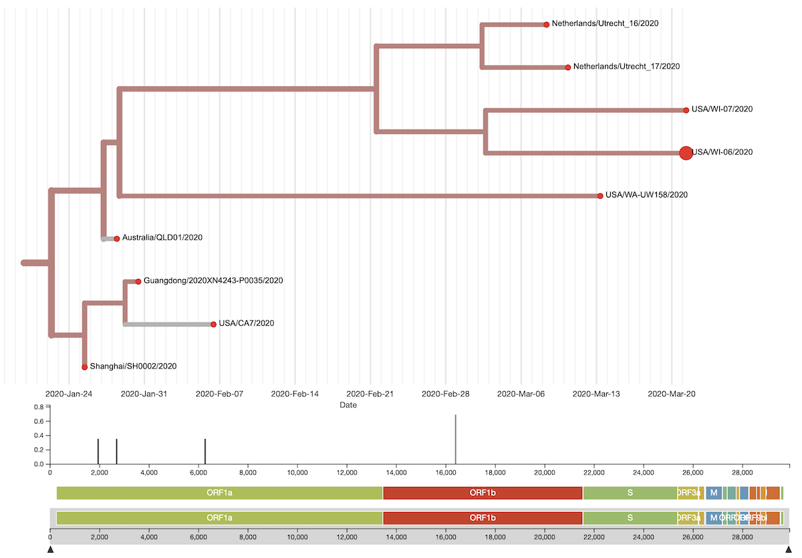
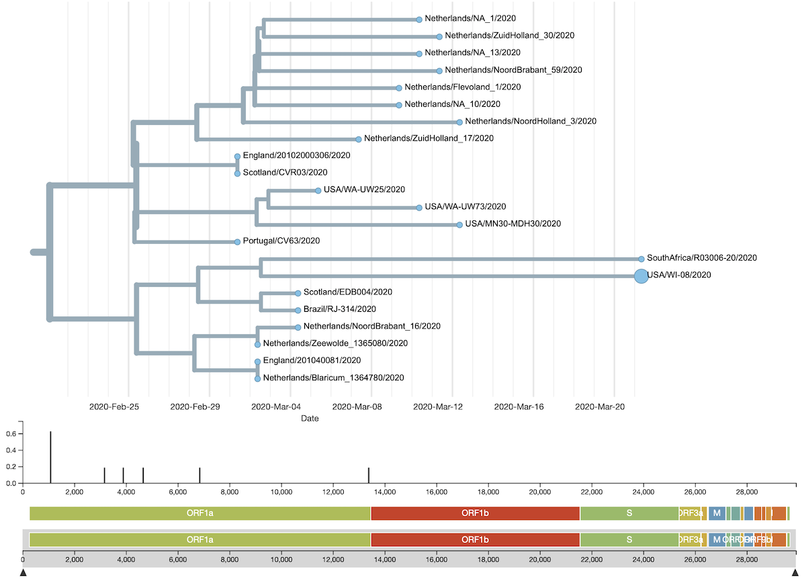
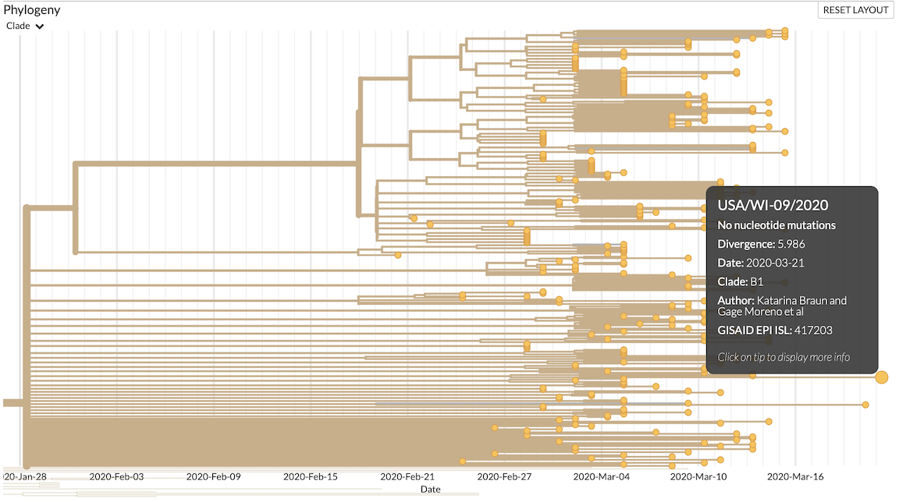
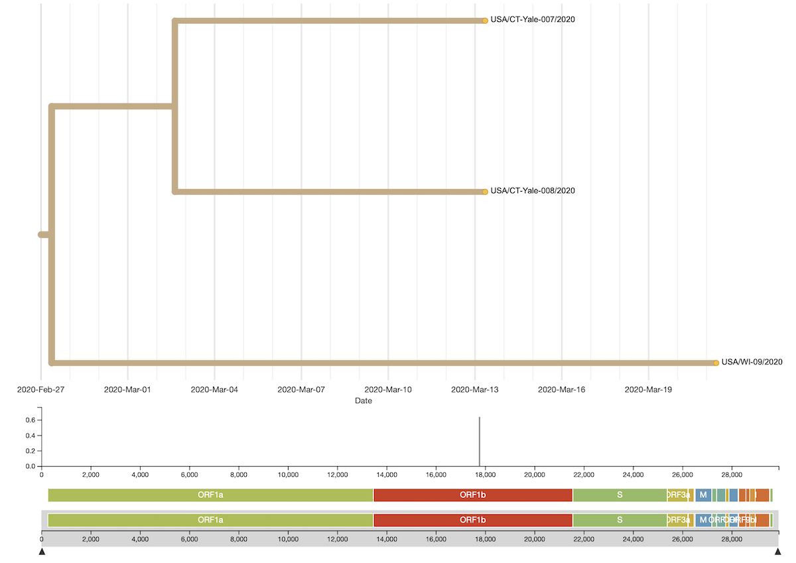
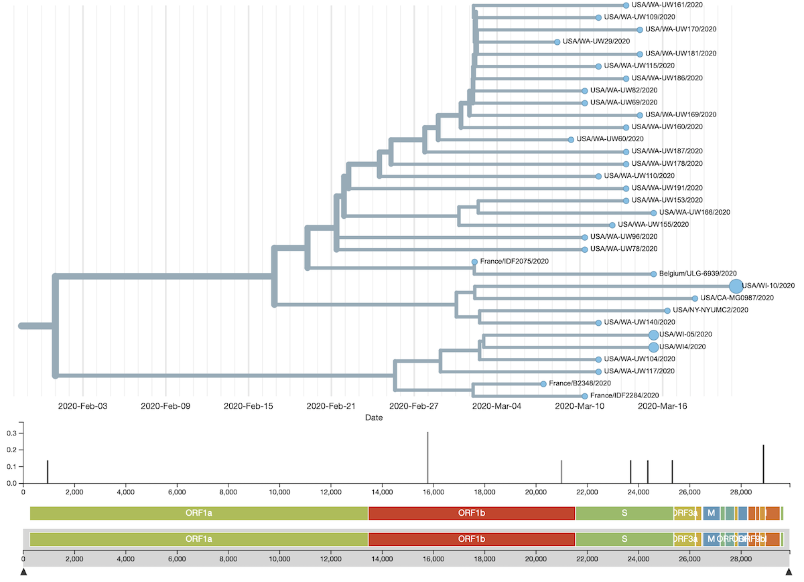

### Authors

**Katarina Braun** (graduate student in Thomas Friedrich's lab)  Twitter: [@KATarinambraun](https://twitter.com/KATarinambraun) GitHub: [katarinabraun](https://github.com/katarinabraun)

**Gage Moreno** (graduate student in Dave O'Connor's lab) Twitter: [@GageKMoreno](https://twitter.com/GageKMoreno)

---------------------
## Data availability

We have made our cleaned FASTQ* files available at the following SRA: [PRJNA614504]()

**Note these FASTQs have been depleted of host sequences and other contaminating sequences.

These analyses and scripts are additionally available on GitHub [SARS-CoV-2_sequencing](https://github.com/katarinabraun/SARS-CoV-2_sequencing)

---------------------
## Scripts used
### ONT scripts
The entire [ONT workflow](https://openresearch.labkey.com/wiki/ZEST/Ncov/download.view?entityId=4eb3b231-36df-1038-8f6c-473ee5860183&name=ONT_Workflow.zip) is uploaded as a series of snakemake and bash scripts that can be run one by one or can by run sequentially using the `workflow.sh` script as a driver script.
A brief description of the ONT workflow contents:
- `01.partition.sh` - will combine all ONT fastq_pass files into one merged folder and then will partition it out into 36 sub-folders to demultiplex simultaneously.
- `02.demultiplex.snakefile` - Runs `qcat` on the 36 sub-folders. Discards reads <300bp in length. Trims out ONT adaptors and barcodes.
- `03.merge-demultiplex.sh` - Merges the demultiplexed reads into a single fastq.gz for each barcode using `pigz`.
- `04.subsample_QC.snakefile` - Discards reads ≤Q7 and trims out SISPA primer sequence using `reformat.sh`.
- `05.remove-host-reagent.snakefile` - Uses `minimap` to bioinformatically deplete of host and reagent contaminants.
- `06.map-reference-genome.snakefile` - Maps cleaned reads to a reference file using `minimap` and will call variants ≥10% frequency using `callvariants.sh`.
- `06.bam_to_fastq.snakefile` - Converts the mapped bam file to fastq using `reformat.sh`.
- `07.map-by-gene.snakefile` - Maps cleaned reads to a reference file composed of only the coded gene regions using `minimap`.
- `08.call-variants-by-gene.snakefile`- Call variants in the coded gene regions using `callvariants.sh`.
- `09.minhash.dataset.snakefile` - Performs `sendsketch.sh` on the entire dataset - outputs the top 1000 hits in your sample.
- `09.minhash.sequences.snakefile` - Performs `sendsketch.sh` and classifies reads on a per sequence basis

## Methods
We sequenced five positive samples from Madison, WI. We started with 3µl of nasal swab sample diluted in 197µl of water. This 200µl original dilution was then processed to extract viral RNA.  

### Sample information 

| Sample Name            | GISAID Accession | SRA Accession | SRR Run #   | BioSample    | BioProject  | Collection Date |
|------------------------|------------------|---------------|-------------|--------------|-------------|-----------------|
| hCoV-19/USA/WI-06/2020 | EPI_ISL_417200   | SRX7988797    | SRR11410125 | SAMN14443954 | PRJNA614504 | 3/21/20         |
| hCoV-19/USA/WI-07/2020 | EPI_ISL_417201   | SRX7988798    | SRR11410124 | SAMN14443955 | PRJNA614504 | 3/21/20         |
| hCoV-19/USA/WI-08/2020 | EPI_ISL_417202   | SRX7988799    | SRR11410123 | SAMN14443956 | PRJNA614504 | 3/21/20         |
| hCoV-19/USA/WI-09/2020 | EPI_ISL_417203   | SRX7988800    | SRR11410122 | SAMN14443957 | PRJNA614504 | 3/21/20         |
| hCoV-19/USA/WI-10/2020 | EPI_ISL_417204   | SRX7988801    | SRR11410121 | SAMN14443958 | PRJNA614504 | 3/21/20         |

We isolated viral RNA using the Maxwell 48. Complete protocol can be found [here](https://openresearch.labkey.com/wiki/ZEST/Ncov/download.view?entityId=b803632d-48fb-1038-80cc-8e513fde0084&name=Maxwell%20RSC%20Viral%20Total%20Nucleic%20Acid%20Purification%20Kit%20TM420.pdf)

We prepared each sample for ONT sequencing using the ARTIC network tiled amplicon approach 
2. ARTIC [complete protocol](https://www.protocols.io/view/ncov-2019-sequencing-protocol-bbmuik6w).

We then prepared libraries for Oxford Nanopore Sequencing on a GridION using the 1D ligation sequencing kit (SQK-LSK109) with its native barcodes and sequenced on an R9.4 flow cell. 

Millions of ONT reads were available within 14 hours of initiating sequencing. SISPA prepped reads were demultiplexed using `qcat` and bioinformatically depleted of host and reagent contaminants. ARTIC reads were also demultiplexed using `qcat` but were not depleted of host and reagent contaminants. All reads <300bps in length were discarded as well as reads with a quality score ≤Q7. Cleaned viral reads were then mapped to the severe acute respiratory syndrome coronavirus isolation from Wuhan, China (Genbank: MN908947.3) using `mimimap2`. The resulting mapped reads were then imported to Geneious Prime 2020 to visualize the reads and generate consensus sequences.

## Results

#### Coverage across SARS-CoV-2 genome
Here we show the results for each sequencing approach. After 14 hours, the ARTIC protocol generated consistent coverage across the genome, except for a few drop out regions. These regions have already been identified in the ARTIC primer V1 protocol as primer-dimer complexes that inhibit amplification. Future experiments using ARTIC primers V2/V3 will hopefully even out the coverage in these regions. 

Our group is working to write custom scripts that will stop collecting data once each amplicon reaches 200x coverage. This will allow us to cut down on sequencing time, as well as the time it takes to generate consensus sequences and SNP calls. We envision that this approach will allow us to ramp up sequencing efforts as we cut down on the time it takes process and analyze the data. 

#### Consensus level differences between samples

We mapped all swabs against the Wuhan reference sequence (MN908947.3) and identified consensus-level differences from the reference sequence and the five swabs we sequenced here. We also took a quick look at the impact of each of these SNVs and have included these annotations in the second table. 

*Syn*: synonymous variant, silent mutation
*Nonsyn*: nonsynonymous variant, amino-acid changing mutation 

hCoV-19/USA/WI-06/2020 differed from the Wuhan reference sequence at 10 nucleotide positions, 8 of these fell in open reading frames. Six of these SNVs are nonsynonymous variants and two are synonymous variants. hCoV-19/USA/WI-06/2020 does not contain the defining 3bp in-frame deletion in ORF1b that the Madison reference contains -- this is the case with all five sequences in this report. 

hCoV-19/USA/WI-07/2020 differed from the Wuhan reference sequence at 9 nucleotide positions, 8 of these fell in open reading frames. Five of these SNVs are nonsynonymous variants and three are synonymous variants.

hCoV-19/USA/WI-08/2020 differed from the Wuhan reference sequence at 6 nucleotide positions, 5 of these fell in open reading frames. Two of these SNVs are nonsynonymous variants and three are synonymous variants.

hCoV-19/USA/WI-09/2020 differed from the Wuhan reference sequence at 6 nucleotide positions and all 6 of these fell in open reading frames. Three of these SNVs are nonsynonymous variants and three are synonymous variants.

hCoV-19/USA/WI-10/2020 differed from the Wuhan reference sequence at 7 nucleotide positions, 6 of these fell in open reading frames. Three of these SNVs are nonsynonymous variants and three are synonymous variants.

Overall, consensus-level SNVs are most likely to fall in ORF1ab (which occupies the majority of the genome). We have identified very few SNVs in the S gene, which encodes Spike protein expressed on the surface of the virion -- and is therefore antigenically most relevant. 
There are two few consensus-level SNVs to make confident inferences regarding population selective pressures. We have not called minor variants at this time, but hope to do this soon. 

#### Nextstrain phylogenies 
Consensus sequences were uploaded to GISAID and subsequently added to Nextstrain for phylogenetic analyses. Sample naming scheme is in the table below. 

| Nextstrain Name                                                                   | GISAID Accession Number                                    |
|-----------------------------------------------------------------------------------|------------------------------------------------------------|
| [USA/WI-06/2020](https://nextstrain.org/ncov?c=clade_membership&s=USA/WI-06/2020) | [417200](https://platform.gisaid.org/epi3/frontend#50d5ae) |
| [USA/WI-07/2020](https://nextstrain.org/ncov?c=clade_membership&s=USA/WI-10/2020) | [417201](https://platform.gisaid.org/epi3/frontend#17e171) |
| [USA/WI-08/2020](https://nextstrain.org/ncov?c=clade_membership&s=USA/WI-08/2020) | [417202](https://platform.gisaid.org/epi3/frontend#560102) |
| [USA/WI-09/2020](https://nextstrain.org/ncov?c=clade_membership&s=USA/WI-09/2020) | [417203](https://platform.gisaid.org/epi3/frontend#6231c7) |
| [USA/WI-10/2020](https://nextstrain.org/ncov?c=clade_membership&s=USA/WI-10/2020) | [417204](https://platform.gisaid.org/epi3/frontend#6231c7) |

USA/WI-01/2020 - Original Wuhan cluster, distinct transmission chain 
USA/WI-02/2020 - Clade A2a, from Europe, distinct transmission chain 
USA/WI-03/2020 - Clade A2a, from Europe, distinct transmission chain 
USA/WI-04/2020 - Clade A2a, from Europe via WA, distinct transmission chain 
USA/WI-05/2020 - Clade A2a, from Europe via WA (with WI4 transmission chain) 
USA/WI-06/2020 - Clade B4, from Australia, distinct transmission chain 
USA/WI-07/2020 - Clade B4, from Australia, (with WI6 transmission chain) 
USA/WI-08/2020 - Clade A2a, From Europe via South America, distinct transmission chain 
USA/WI-09/2020 - Clade B1, from Washington, distinct transmission chain 
USA/WI-10/2020 - Clade A2a, from Europe via WA (with WI4 transmission chain) 

Based on Nextstrain phylogenetic analysis, it looks like there have been at least ≥6 separate introductions of SARS-CoV-2 into Wisconsin. The phylogenies for the newest sequences have been shown in the figures below. 

#### Phylogeny for USA/WI-06/2020 & USA/WI-07/2020

#### Phylogeny for USA/WI-08/2020

#### Phylogeny for USA/WI-09/2020

#### Phylogeny for USA/WI-10/2020
