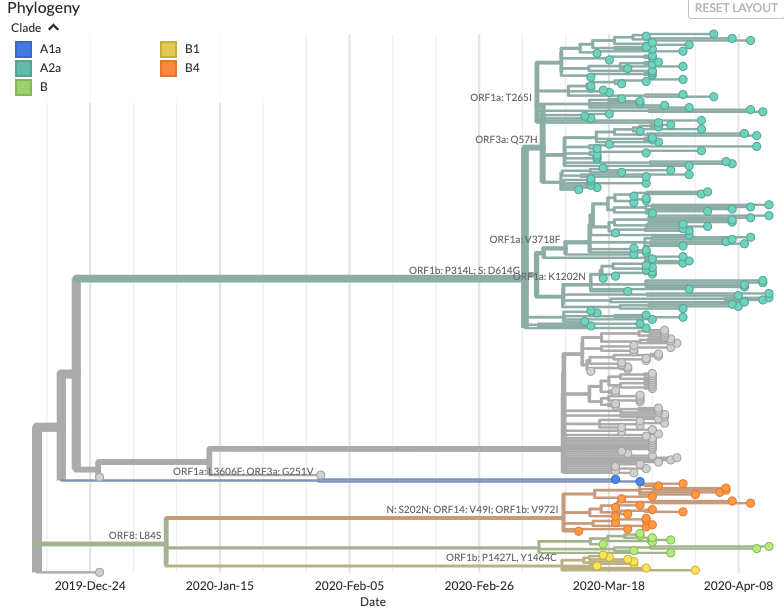

# SARS-CoV-2 Deep Sequencing 

At the University of Wisconsin-Madison, the AIDS Vaccine Research Laboratories have been working together to sequence positive SARS-CoV-2 nasal swab samples from patients that present to the University of Wisconsin Hopsital and Clinic system.

Principal investigators leading these efforts are Drs. Tom Friedrich, Dave O'Connor and Shelby O'Connor. Sequencing efforts, at this point, have been led by [Gage Moreno](https://twitter.com/GageKMoreno) and [myself](https://twitter.com/KATarinambraun). 

We are aiming to sequence as many samples as possible and will write up brief analysis reports as frequently as possible. We will submit consensus sequences to GISAID (which will be fed into [Nextstrain phylogenies](https://nextstrain.org/ncov)) and we will additionally submit cleaned fastq datasets (human reads removed) to SRA to facilitate open datasharing. 

We are additionally tracking these reports on our [LabKey portal](https://openresearch.labkey.com/wiki/ZEST/Ncov/page.view?name=sars-cov-2-sequencing). 

We are sequencing via a number of methods, but moving forward we will primarily sequence on an ONT Nanopore GridION and will use the [ARTIC sequencing protocol](https://artic.network/ncov-2019). The earlier reports will include sequencing using a non-specific, metagenomic approach called [SISPA](https://www.protocols.io/view/sequence-independent-single-primer-amplification-o-bb3miqk6). We will include some Illumina MiSeq sequencing as well. 

<h1>SARS-CoV-2 Wisconsin-only Phylogenetic Tree</h1>  
<h3> Click the link below to check out an interactive Nextstrain build for Wisconsin sequences only <h3>

 <map name="image-map"> 
<area title="WI NextStrain build" shape="rect" coords="9,3563,4801,4" href="http://35.226.31.45/ncov/2020-04-14?branchLabel=aa&amp;c=clade_membership" alt="WI NextStrain build" target="" /> </map>

<h3>Overview of Wisconsin SARS-CoV-2 sequencing</h3>
<ul>
<li><a href="http://35.226.31.45/ncov/2020-04-14?branchLabel=aa&amp;c=clade_membership">Wisconsin-specific "Nextstrain" build</a></li>
</ul>
<h3>SARS-CoV-2 viral sequencing protocols</h3>
<ul>
<li><a href="https://www.protocols.io/view/ncov-2019-sequencing-protocol-bbmuik6w">Artic Network SARS-CoV-2 Sequencing Protocol</a></li>
<li><a href="https://docs.google.com/document/d/1bUzlTXuaEzJ-vagLUwr0GsdhJWP6Gclg45D_vUjuUBA/edit?usp=sharing">Sequence-Independent, Single-Primer Amplification of RNA viruses - Protocol</a></li>
</ul>

